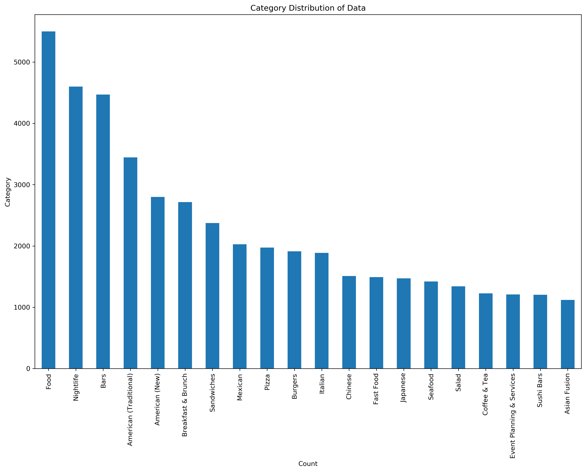
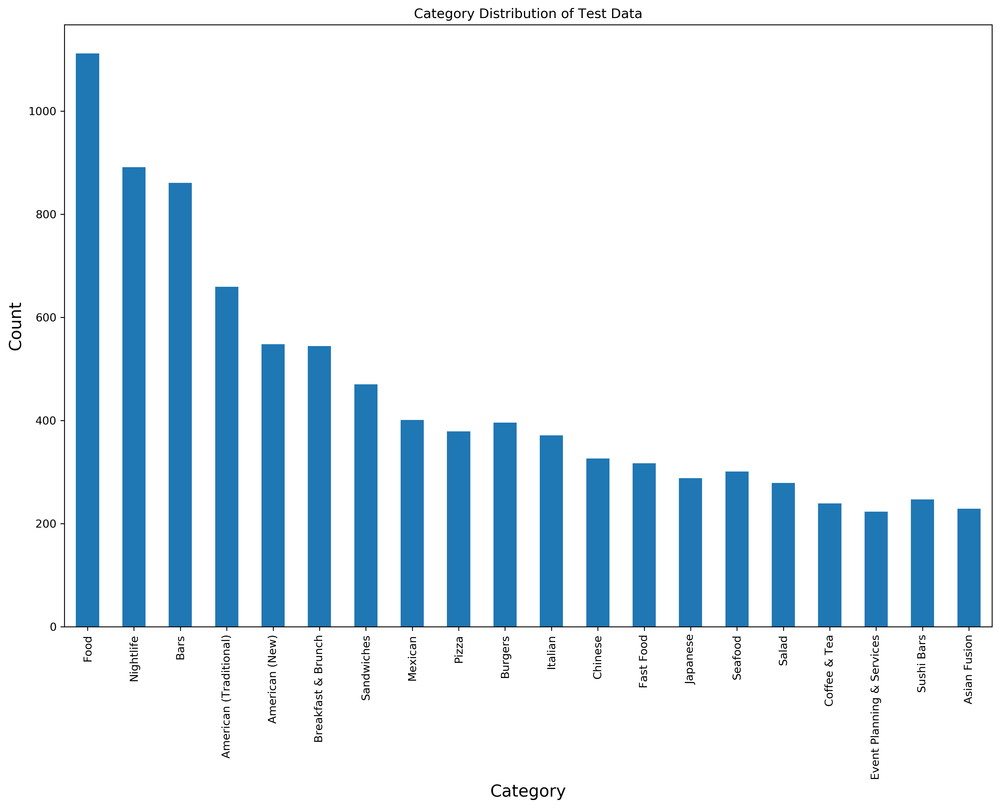

# Restaurant_Tag_Predictor

## Files:
- Data_prep: Preparing the files and data before NLP and Modeling
- Data_process_modeling: NLP and train/testing models
- Visualizations folder: Images from EDA

## Overview:
The pupose of this project is to attempt to build a model to predict the tags(or labels/categories) of a restaurant based on the user reviews for the restaurant. If successful this could help apply relevant tags to restaurants or be used to periodically update the tags. This would be helpful to provide users more accurate search results so they would not something because of missing tags.

## Process:

### Data Gathering:
Collected data from the Yelp Dataset(source at the end), which contains a number of json files about businesses, reviews, and users. There was information for 200k+ businesses and 8M+ reviews. I only used the business information dataset for the categories/tags of each business and the review dataset for the reviews.

### Data Preparation:
- Took a subset of businesses with the “Restaurants” tag. The dataset is so huge that running models with all the businesses would take too long. I also wanted the focus to be on Restauants with the idea being possible to apply to others as well.
- Created dummy columns for tags so that I could use these both to filter out the restaurants, but also serve as my target variables when modeling.
- Joined reviews for each business into one cumulative one so that I could use the total vocabulary and counts from each restaurant to predict the tag. There were about 20,000 restaurants that had 50+ reviews.

### Data Processing:
- Limited to top 20 tags with most restaurants because there were a large number of tags and most had very few restaurants with the tag which would affect the models' learning. It also helped lower computational time for the models.
- Filtered restaurants that did not have these tags and 50+ reviews so that there would be a decent level of vocab used for the restaurant and the model would be better able to learn and predict from that.
- ~18k restaurants were left in the final dataset before I ran my models
- NLP on reviews: tokenize, remove stop words, lemmatize and then TF_IDF vectorization.
- SpaCy was used to vectorize each cumulative review using word embeddings as a separate way to run models on

### EDA:

The distribution of restaurants per tag limited to the top 20 were as follows:

### Modeling and Evaluation:
- Used sci-kit learn and sci-kit multilearn to fit models to a training set and predict on a testing set. Binary Relevance was used so each model predicted the each tag separately for each restauarant and then put the results together. 
- Used a DummyClassifier as a baseline, predicting the majority class, which in this case all tags had a majority class of 0 or negative.
  - Precision Score: 0, F1: 0
- Ran a Gaussian Naive Bayes and Random Forest Classifier and compared to baseline results
- When using the TF-IDF-vectorized data:
  - GNB: Precision Score: 0.57, F1: 0.29
  - RFC: Precision Score: 0.90, F1: 0.55
- When using SpaCy vectorized data:
  - GNB: Precision Score: 0.33, F1: 0.46
  - RFC: Precision Score: 0.87, F1: 0.62
  - XGBoost: Precision Score: 0.81, F1: 0.68
  
  
### Visuals:

This is the distribution of the test set tags:

This is the distribution of the predicted tags:

## Results:

- Random Forest had the highest Precision score using TF-IDF and SpaCy vectors
  - SpaCy vectors use less memory and reduce complexity, bringing number of features from 100K+ better model
- The reason for using precision as the main evaluation metric is because especially in early stages false positives are worse as they can lead to misinformation, which is bad for trust and especially bad for dietary tags
- Somewhat low F1 score implies some missed labels
- Distribution of results supports missing labels

## Next steps:

- Use Gridsearch to tune models
- Try assigning different thresholds or weights for different tags
- Try setting up a neural net
- Try expanding the Model to include all Businesses and tags, not just Restaurants
  - This would be much more memory and computationally expensive, so that is something to keep in mind

## Sources:
Yelp Dataset: https://www.yelp.com/dataset

Presentation Slides: https://docs.google.com/presentation/d/1fd-3z5nSrtE7D0vIdBN2LIPMmU0oDt0UfjgqDbDSW4c/edit#slide=id.g8b627552d6_0_2
